# aboutechoesofuniverse
# Welcome to Echoes of Website Created By Madhu Rayala and Echoes Team
## What is this Website About?
This Website is created to start a global transformation in the Academic World.This Webiste helps many Students access various resources related to their Syllabus,Homework Banks,Recordings of their Subjects.Along with this,they can access information related to Various Categories,Agriculture,Aerospace,Manufacturing,Finance,Food,Pharmacy,Law etc.

 

## How to Get Started (For Beginners)  
Follow these steps to make the most of MyWebsite:
1. ** Home Page **:
  You can view different cards on the Dashboard.Each card displays information related to the Sector.
 

****Cyber Program Resources****
   -Navigate to 2nd card and Click on  "Class & Subject" dropdown, we will get options "X - State - Computer Science","IX - State - Social",....
   - After selecting class,subject:another dropdown gets displayed which shows "Select Chapter" ,Click on "X - Computer Science - Chapter -1 and Chapters get displayed.
   - There are more buttons called "Honor Roll List" , "Syllabus Warriors List" .When we click that List of Students names get displayed and If we want to return back to the Homepage then click "HOME".

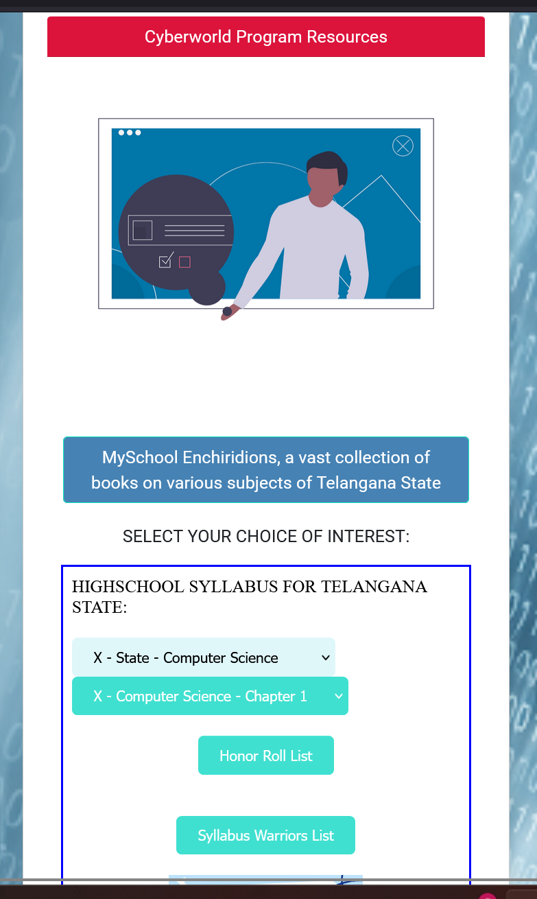

 

****CyberWorld Creative Works****
 - We can see a Title  Named "Wiki Enchiridion",When you click on "Select Category",list of categories will get displayed such as Musems,Water Bodies,Mountains,Birds etc.And Image gets displayed after choosing the option from the dropdown and Clicking on that image leds to Wiki page based on the selection of the category.
****MySchool Projects****
- We have added 2 Hierarchical Dropdown Menus in the MySchool Projects card.
- We have integrated a detailed dropdown navigation system that allows users to seamlessly select options from continent-level (e.g., Asia) down to district-level locations.Upon reaching to district-level dropdown, we get other dropdown which shows sectors namely, Education,Healthcare,Farming,Manufacturing,Government,Software.Upon selecting Education sector,We see other dropdown with options Primary School,High School,Intermediate,Degree,Engineering,Medicine,When we  select High School,list of high Schools from selected city(Khammam) get displayed.Select School,and class(10th,9th,8th...) ,and  subject(BIOLOGY,COMPUTER,PHYSICS,MATHS,SOCIAL) and click on chapter,chapter gets displayed.
- Upcoming Additions: Plans are underway to include chapters and content for other states across various educational institutions.
   

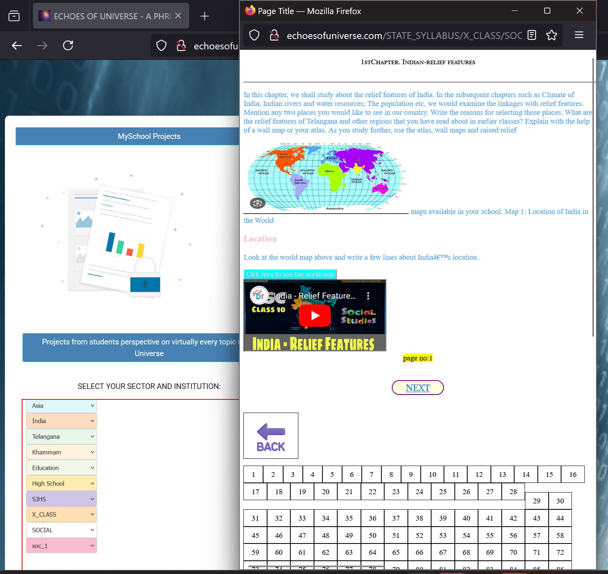

*Foods and Festivals Around the World*
Select Continent,Country and Select Type(Festival,Food) and click on displayed image or word, you will get redirected to respective links.

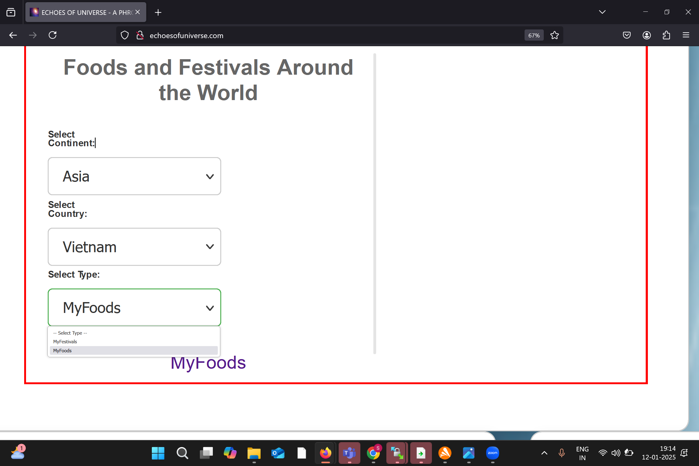
 

* Click on the Image to Learn more about AIC('Academic Industrial Complex')

  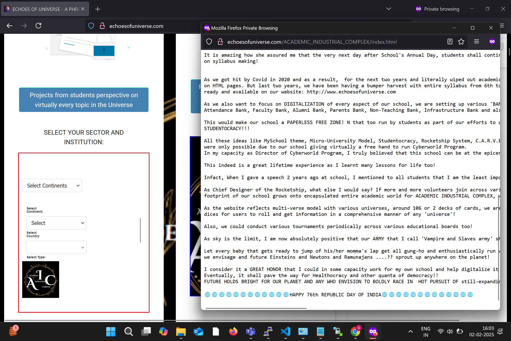
 
****MySchool Calendar & Banks****
- We can see a calendar pointing to today's date
- Select a Bank from the options "Homework Bank","Syallabus Bank","Attendance Bank" and "Hostel Bank".After you select a bank,you can select a year(2024-2025,2023-2024 and so on),Class dropdown will be displayed when you select year dropdown.Once you select an option from class dropdown,section dropdown will get displayed.Based on the selection of the section,data related to students will get dispalyed in the Popup. 
 
 Bank -> Year -> Class -> Section
 
 

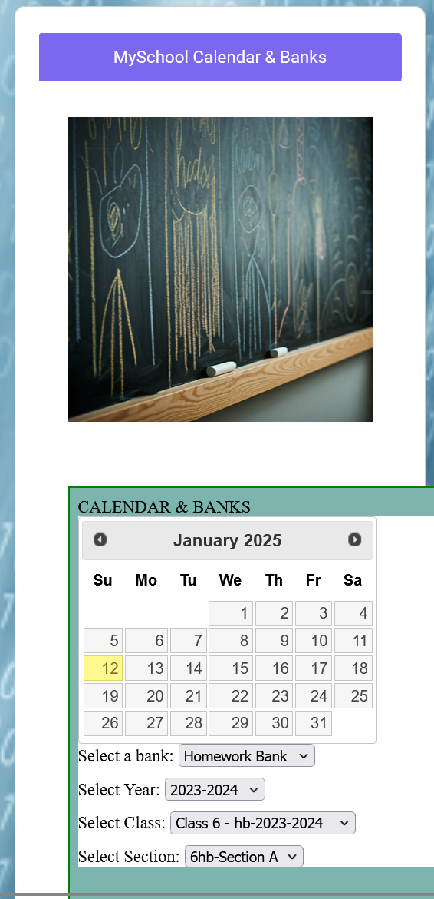

****HealthCare Universe****
- Click on Medical Encyclopedia dice.
- We have 6 faces and Each face contains a image related to Healthcare and If someone clicks dice 6 times,6 different list of options will be displayed.Click the option in the list and information related to that option will be displayed. 
   
  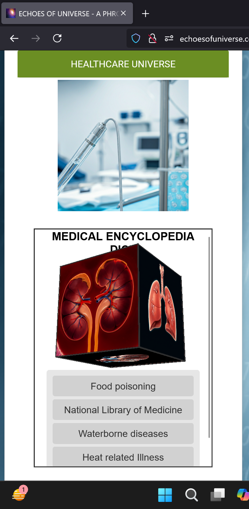
   

  
****Echoes Vision****
- In Topbar,there is a button named Echoes Vision click it,You can see list of options called "Echoes Vision,Create Blog and View Blog.
   
    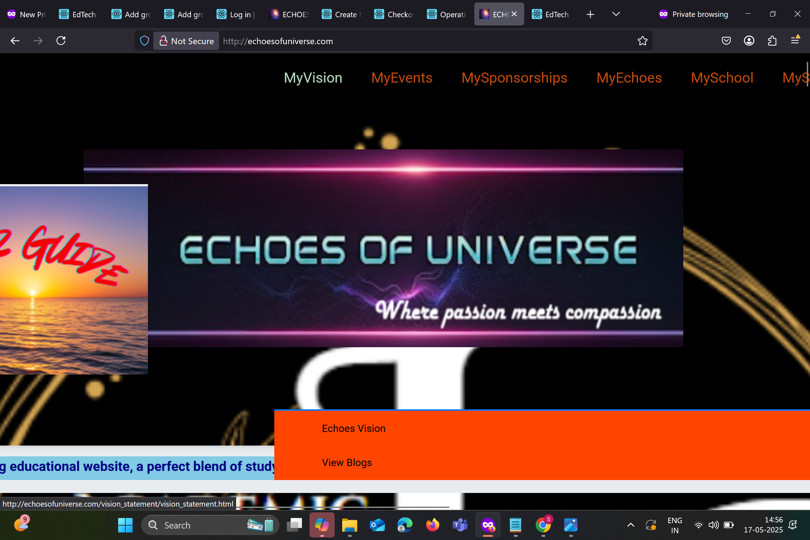 

   
  
- Click on Echoes Vision in the dropdown,you can view the Vision statement.
- Click on View Blog to know the latest updates of our website.
- Click on Create Blog,If you see "WORKING ON THE SITE! GO BACK HOME",please login first.You need to register to login.For registartion click "http://echoesofuniverse.com/djangoapplication/register/". Login can be done by "http://echoesofuniverse.com/djangoapplication/login/". After registartion and login are completed,then click on create blog dropdown.It can be accessed now.You can create a blog and save it.Click on Back to Blog list to view your blog.
  
 

  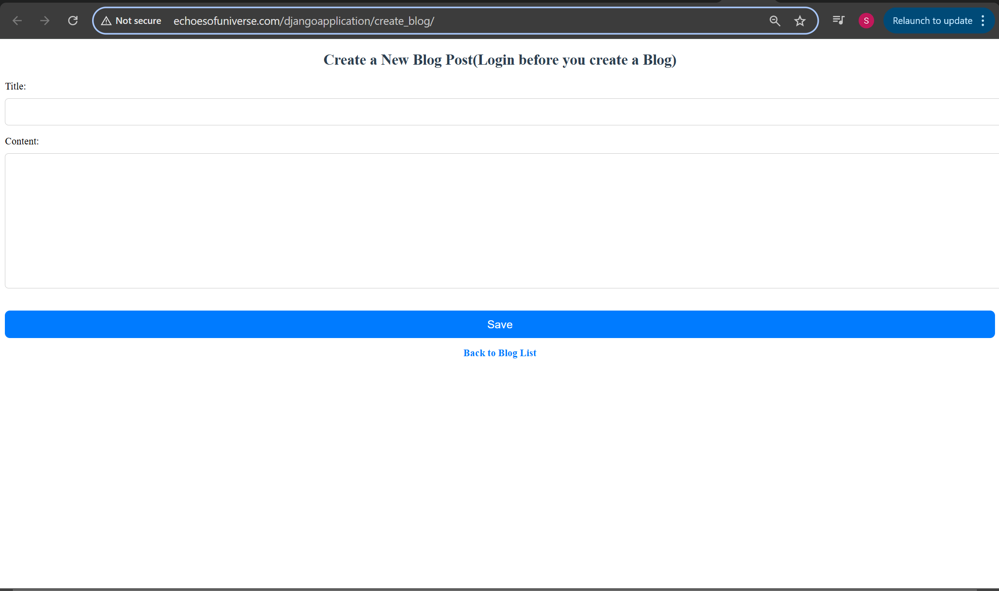 
  
   

  ****MySchool & MyServices****
- In topbar,there is a button named MySchool & MyServices,when you click,you can see 2 dropdowns,"Annual day Presentation" and "SOLOLEARN WORKS BY STUDENTS".Select SOLOLEARN WORKS BY STUDENTS to view pages created by SJHS students.Select Annual day Presentation to know more about Cyberworld Program.
 

  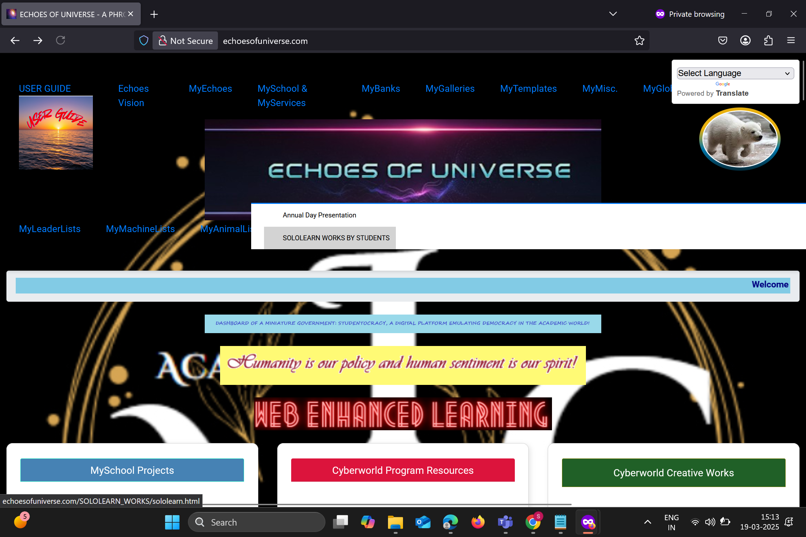 
  
   

****TEMPLATE****

-   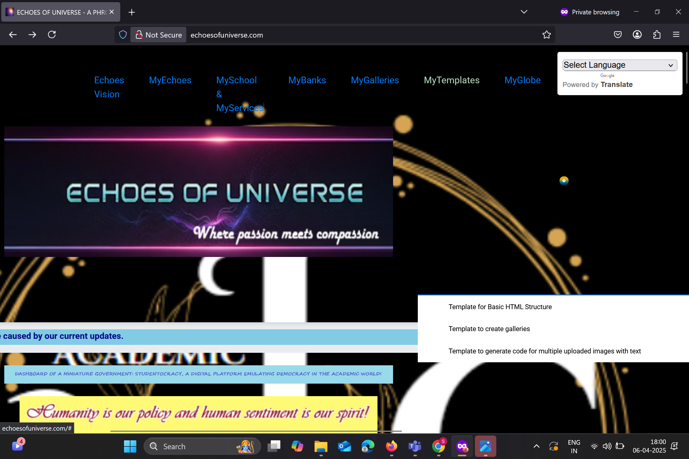 

- We have added "MyTemplates" Menu in Topbar,Under MyTemplate, there are 3 choices "Template for Basic HTML Structure","Template to create Galleries","Template to generate code for Multiple Uploaded Images with Text".

-   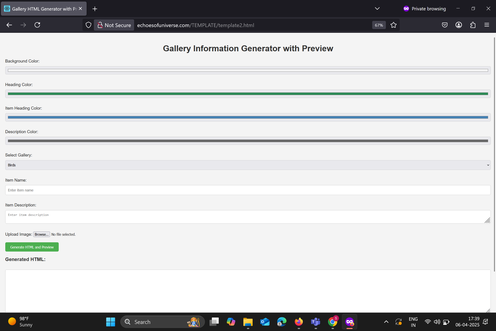 
- This is the Template to create Gallery.
- Instead of giving color codes in CSS for BACKGROUND COLOR,HEADING COLOR ,ITEM HEADING COLOR,DESCRIPTION COLOR, we can click on the lines and directly change the color,we can also create new gallery or use existing gallery with the help of "SELECT GALLERY" field,Incase if you click on "Create new Gallery" ,Enter "NEW GALLERY NAME".In ITEM DESCRIPTION field,paste the text and Upload the image with the help of "UPLOAD IMAGE" field.Click on GENERATE AND PREVIEW,HTML code is created and we can Preview the changes.
- This Template saves a lot of time as we are not writing the code of CSS,HTML.We are just adjusting the colors with the help of this template and getting the code.
- You can copy and Paste the code in your Project.

- If you need Multiple Images in your HTML code,You can choose "Template to generate code for Multiple Uploaded Images with Text" from "MyTemplates".As this selection helps you a Web pages wich has fields such as "TITLE","UPLOAD IMAGE 1",DESCRIPTION 1","ADD ANOTHER IMAGE".After uploading one image,if you want to add more images ,you can click "ADD ANOTHER IMAGE",which shows "UPLOAD IMAGE N", "DESCRIPTION N".With this you can add "N number of Images" in your code.

- Click "Generate HTML" which shows you the code.Preview is also available along with the generated HTML code.

- If you want to Tables,lists in your code,You can choose "Template for Basic HTML Structire" from "MyTemplates".Fill the respective fields and click on Generate HTML.HTML code and Preview will be displayed.Based on the text in the fields,HTML code and Preview are modified.

*****UPLOAD SYLLABUS IN THE SERVER JUST BY FILLING THE FORM(Can't specify the foldername here as this git readme file is public,Reachout to Echoes Team for clarity):*****

Step 1: http://echoesofuniverse.com/djangoapplication/syllabusuploadpages/register/ 
- Register Your College Name.

College Name: ABC

Country: Country in which user resides

State/Region: State in which user resides

City: City in which user resides

Click on "Register",You will be naviagted to Success Page,after successful registration.

Step 2: http://echoesofuniverse.com/djangoapplication/syllabusuploadpages/upload_syllabus/ 
- College: This will be automatically populated in Dropdown as we have registered college in Step 1. "ABC"

Subject Name: Fill out the subject name such as Physics,Chemistry,Maths.

Page Title: User's Wish

Syllabus Content: Paste your HTML code here

Page Order: 1,2,3,4,.....

Click on Upload,It will Naviagte to Success Page,If you want to upload more Pages,You can Upload ny using the link in Step-2

This will be stored in Server.folder_name/Country/State/Subject/PageTitle.

Eg: http://echoesofuniverse.com/djangoapplication/syllabusuploadpages/syllabus/INDIA/TELANGANA/Physics/chapter-1/ 

NOTE:Use Capital Letters for Country,State,City or for anyfield for clarity.It helps to reduce confusion.

**** PUBLIC COLLECTIONS AND MYCOLLECTIONS****
* Click Public Collection (Public collections can be accessed by https://echoesofuniverse.com/djangoapplication/wordcollection/public/collections/).You can access Collections which are made public by Users.
* To make your collection public,you need to follow the below steps:
  - step 1: Register and login to our website if you haven't done before.
  - step 2:
     
             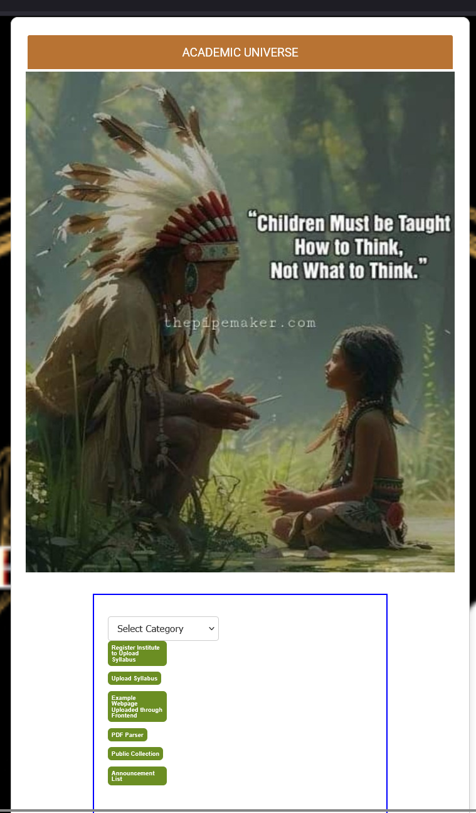
     
    After logging in,click MyCollections(Refer above image).Click "Create a Collection".You can see fields such as "Name,Is public".You can specify Name of the collection and If you want to show your collection to world,you can use the field "Is public" field.You can check mark the field 'Is public",so that the collection you made will be accessible to outside world.Click "Create Collection".
    Eg: Name : English Collection, Is public [check] - click Create Collection.
- step 3:
  You can check all the collections you created by clicking "Back to MyCollections".
- step 4: You can click on created collection and click on "Add word",We can add many words and their meanings,synonyms etc.You need to fill 2 fields  Term and Data : 
EG: Term: ubiquitous
   Data :
   
  {
    "Meaning": "Present, appearing, or found everywhere.",
    "Type": "adjective",
    "Synonyms": ["pervasive", "prevalent", "universal"],
    "Example Sentence": "Smartphones have become ubiquitous in modern society."

} 

Data need to filled in Json format.We can make modifications further for HTML template for  data field.

step 5: Add the word and You can see all this data in a table format. I have created "English Collection".

 
             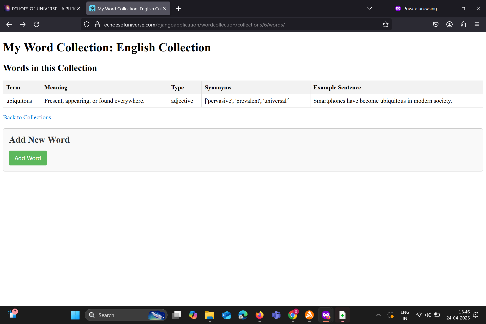

 
You can create "Science Collection","Social Collection".
Intially this process can be used by Teachers as they can add new words everyday and create collections related to their subject.Later on this process can be explained to students to maintain their own collection and they can use it as their own dictionary.

    

   
  **** Echoes of Universe Online Store : *****

  * If you don't have an account on our website,Please Register http://echoesofuniverse.com/djangoapplication/register/
  * Please login into our website to use the Ecommerce features. http://echoesofuniverse.com/djangoapplication/login/
  * After you have logged in,Click this url http://echoesofuniverse.com/djangoapplication/shopping/home/ , to view the items that are on sale.
     
         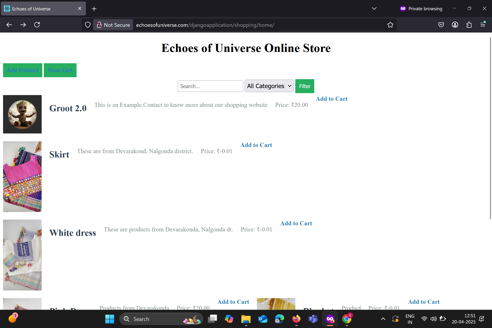 
 
  * If you want to sell something on our Echoes of Universe Online Store,please click "Add Product" or click  http://echoesofuniverse.com/djangoapplication/shopping/add-product/ to add your product and fill the details such as "Name of the Product,Description,Price,Category,Image,Owner email,Phone number,owner name".After fllling all the details,click "Upload Product".These products will be shown in Home page of our Echoes Online Store.
    
 * Once you click add to cart near an product in home page,it will redirect you to http://echoesofuniverse.com/djangoapplication/shopping/cart/ or  You can add items in cart,you can view your cart by clicking http://echoesofuniverse.com/djangoapplication/shopping/cart/,You can also remove items in your cart and  you can checkout by http://echoesofuniverse.com/djangoapplication/shopping/checkout/
       
 * Search functionality is also available in Home page of Echoes of Universe Online Store.

   
