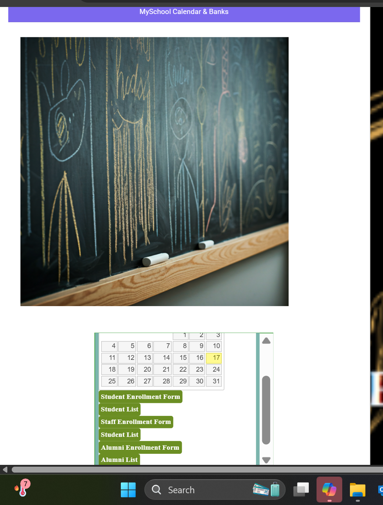
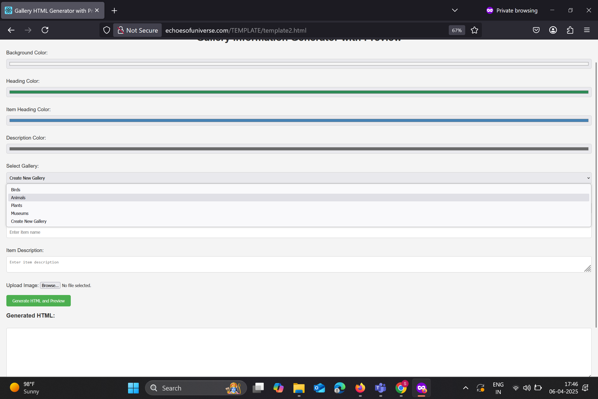
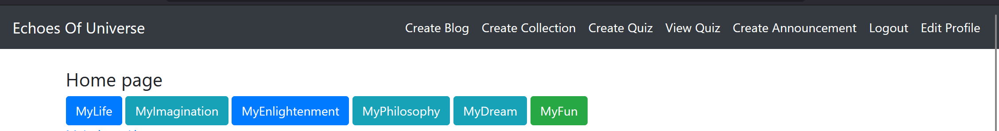

# aboutechoesofuniverse
# Welcome to Echoes of Website Created By Madhu Rayala and Echoes Team
## What is this Website About?
This Website is created to start a global transformation in the Academic World.This Webiste helps many Students access various resources related to their Syllabus,Homework Banks,Recordings of their Subjects.Along with this,they can access information related to Various Categories,Agriculture,Aerospace,Manufacturing,Finance,Food,Pharmacy,Law etc.

 

********SCREEN RECORDINGS********
    
****First Card - MySchoolProjects****   -  https://youtube.com/shorts/aDZONqFzr1g?feature=share
 

****Second Card - CyberWorldProgramResources****  - https://youtube.com/shorts/gUf2znQ9cXk?feature=share
 

****EchoesofUniverse Online Store****  - https://youtu.be/DU3tKlP_wiw
 

****MicroUniversity****   - https://youtube.com/shorts/2ETf837fxeQ?feature=share 
 

****Create Blog and View Blogs****  -  https://youtu.be/w5KIB_uFCK0
 

****Create Quiz and View Quiz****   -https://youtu.be/A8wKB2mfX50 
 

****Create Announcement****   - https://www.youtube.com/watch?v=3qYzsQY52cA 
 

## How to Get Started (For Beginners)  
Follow these steps to make the most of MyWebsite:
1. ** Home Page **:
  You can view different cards on the Dashboard.Each card displays information related to the Sector.
 

****MySchool Projects****
- We have added 2 Hierarchical Dropdown Menus in the MySchool Projects card.
- We have integrated a detailed dropdown navigation system that allows users to seamlessly select options from continent-level (e.g., Asia) down to district-level locations.Upon reaching to district-level dropdown, we get other dropdown which shows sectors namely, Education,Healthcare,Farming,Manufacturing,Government,Software.Upon selecting Education sector,We see other dropdown with options Primary School,High School,Intermediate,Degree,Engineering,Medicine,When we  select High School,list of high Schools from selected city(Khammam) get displayed.Select School,and class(10th,9th,8th...) ,and  subject(BIOLOGY,COMPUTER,PHYSICS,MATHS,SOCIAL) and click on chapter,chapter gets displayed.
- Upcoming Additions: Plans are underway to include chapters and content for other states across various educational institutions.
   

*Foods and Festivals Around the World*
Select Continent,Country and Select Type(Festival,Food) and click on displayed image or word, you will get redirected to respective links.

 

* Click on the Image to Learn more about AIC('Academic Industrial Complex')

  
 

****Cyber Program Resources****
   -Navigate to 2nd card and Click on  "SELECT YOUR DISCIPLINE" ,Options such as "High School","Jr.Intermediate College" will be displayed.
   Eg: "HighSchool"-->"HighSchool Class & Subject" -->"X - State - Computer Science","IX - State - Social",....--->"Select Chapter"-->X-Computer Science-Chapter 1,X-Computer Science-Chapter 2,....
   - After selecting class,subject:another dropdown gets displayed which shows "Select Chapter" ,Click on "X - Computer Science - Chapter -1 and Chapters get displayed.
   - Please select your citation category from the following options:
     SELECT CITIATIONS - "Grand Masters List" "Honor Roll List" , "Syllabus Warriors List" Once selected, a list of student names will be displayed based on your choice. To return at any time, simply click the "HOME" button.

 

****CyberWorld Creative Works****
 - We can see a Title  Named "Wiki Enchiridion",When you click on "Select Category",list of categories will get displayed such as Musems,Water Bodies,Mountains,Birds etc.And Image gets displayed after choosing the option from the dropdown and Clicking on that image leds to Wiki page based on the selection of the category.
    

****MySchool Calendar & Banks****
- We can see a calendar pointing to today's date
- Select a Bank from the options "Homework Bank","Syallabus Bank","Attendance Bank" and "Hostel Bank".After you select a bank,you can select a year(2024-2025,2023-2024 and so on),Class dropdown will be displayed when you select year dropdown.Once you select an option from class dropdown,section dropdown will get displayed.Based on the selection of the section,data related to students will get dispalyed in the Popup. 
 
 Bank -> Year -> Class -> Section
 
 

****New Update on MySchool Calendar & Banks****:
- We have Enrollment forms for Students,Staff and Alumni.

   

   

- Click on Student Enrollment form.Student Enrollment Form consists of fields such as "First Name","Middle Name","Last Name","Father Name","Mother Name","Parent Occupation","Address","Phone number","Email","Roll Number","Class Name","Year".After filling all the fields click on Submit.The submitted data can be viewed in Student List.
- Click on Staff Enrollment Form.Staff Enrollment Form consists of fields such as "Staff name","Staff id","Department","Job title".Click on submit after filling all the fields,The submitted data can be viewed in Staff List.
- Click on Alumni Enrollment Form.Alumni Enrollment form consists of fields such as "First Name","Last Name","Email","Graduation Year","Decade".Click on submit after filling the fields.Click on Alumni List to view all the alumni's of our school.

 
 
 

 *****ECHOES OF UNIVERSE ONLINE STORE :*****

  * If you don't have an account on our website,Please Register.
  * Please login into our website to use the Ecommerce features.
  * You will view the Homepage of Ecommerce website.Currently we have integrated our ***Echoes Store*** with ***The Culinary Nation.***
     
         
     
  * If you want to sell something on our Echoes of Universe Online Store,please click "Add Product" or click  http://echoesofuniverse.com/djangoapplication/shopping/add-product/ to add your product and fill the details such as "Name of the Product,Description,Price,Category,Image,Owner email,Phone number,owner name".After fllling all the details,click "Upload Product".These products will be shown in Home page of our Echoes Online Store.
    
 * Once you click add to cart near an product in home page,it will redirect you to Cart WebPage.You can also remove items in your cart and  you can checkout by clicking Checkout Option.
       
 * Search functionality is also available in Home page of Echoes of Universe Online Store.

 
* If you’re interested in integrating our Echoes Store with your platform or services, please reach out to the Director of Echoes of Universe for further coordination.
  
 
 
 

****HealthCare Universe****
- Click on Medical Encyclopedia dice.
- We have 6 faces and Each face contains a image related to Healthcare and If someone clicks dice 6 times,6 different list of options will be displayed.Click the option in the list and information related to that option will be displayed. 
   
  
   

  ****FILM UNIVERSE****
- Click on the Dice to explore options related to the Film Industry.
   

****SJHS Creative World****
- The Octahedron has 8 faces, each representing a unique theme. Within each face, multiple options are available individually. This interactive card is dedicated to the SJHS team, and showcases webpages created by the students.
 

****FOOD CHAIN UNIVERSE****
- Navigate to Food Chain Universe.You will see images aligned in Traingle shape.
- Click Image and options will be displayed.After selecting the option,respective page related to that option will be displayed.
- These webpages are created by SJHS school,khammam,Telangana Students.
- Also View SJHS creative World,You can view more pages created by students.

*****TOPBAR****:

****MyUserGuide****:
- FAQ , Submit Feedback
- **FAQ**: Check out this Page if you have any questions regarding our website.
- **Submit Feedback**: Please fill out the feedback form and click "Submit" to share your response.

****Echoes Vision****

-  Echoes Vision and View Blog
  
   
  
   
  
   
  
  **Echoes Vision**: Explore to know more about Vision Statement.  
  **View Blogs**: Read our Blogs.       
  
  ****MyEvent**** - AnnualDay2025    
  ****MySponserShip**** - Sponserships 
     
  ****MyEchoes**** - EchoesSite Map,MySchool Modal,C.A.R.V.E,C.H.I.R.P,W.A.S.T.E,CyberWorld Program,Echoes Rocketship,Kohinoor Tournament
     
  ****MySchool**** - Annual Day Presentation, Sololearn Work By Students.
     
  ****MyServices**** - Grand Digital Museum,Miniature Government
     
  ****MyBanks**** - Chronicle Bank,Attendance Bank,Homework Bank,Faculty Bank,Alumini Bank,Syllabus Bank,Student Bank,Hostel Bank,Management Bank,Kohinoor Tournament
     
  ****MyGalleries**** - Exam Gallery,Sports Gallery,Rhymes Gallery,Family Gallery,Science Gallery,Invention Gallery.
     
  ****MyGlobe**** - About India,Facts on India,India on Moon,Syllabus for CSE,Syllabus for State.
     
  ****TEDDY BEAR IMAGE**** - Give the Teddy Bear a click to see what options pop up!
  - Click on the Teddy Bear image to access features like SignUp/Register,Login,Edit Profile,Upload Homework/Other Documents,List of Documents and other useful options.
     
  ****MyTemplates**** - Template for Basic HTML Structure,Template to create Galleries,Template to Generate code for multiple uploaded images with text,Command Template Generator.
     
  

****TEMPLATE****
 

   

  

-   
  
- This is the Template to create Gallery.
- Instead of giving color codes in CSS for BACKGROUND COLOR,HEADING COLOR ,ITEM HEADING COLOR,DESCRIPTION COLOR, we can click on the lines and directly change the color,we can also create new gallery or use existing gallery with the help of "SELECT GALLERY" field,Incase if you click on "Create new Gallery" ,Enter "NEW GALLERY NAME".In ITEM DESCRIPTION field,paste the text and Upload the image with the help of "UPLOAD IMAGE" field.Click on GENERATE AND PREVIEW,HTML code is created and we can Preview the changes.
- This Template saves a lot of time as we are not writing the code of CSS,HTML.We are just adjusting the colors with the help of this template and getting the code.
- You can copy and Paste the code in your Project.
    

- If you need Multiple Images in your HTML code,You can choose ****"Template to generate code for Multiple Uploaded Images with Text"**** from ****"MyTemplates"**** .As this selection shows you a Web page wich has fields such as "TITLE","UPLOAD IMAGE 1",DESCRIPTION 1","ADD ANOTHER IMAGE".After uploading one image,if you want to add more images ,you can click "ADD ANOTHER IMAGE",which shows "UPLOAD IMAGE N", "DESCRIPTION N".With this you can add "N number of Images" in your code.

- Click "Generate HTML" which shows you the code.Preview is also available along with the generated HTML code.

 

- If you want  Tables,lists in your code,You can choose  ****"Template for Basic HTML Structure"**** from ****"MyTemplates"**** .Fill the respective fields and click on Generate HTML.HTML code and Preview will be displayed.Based on the text in the fields,HTML code and Preview are modified.

   
   

****ACADEMIC UNIVERSE****

*****UPLOAD SYLLABUS IN THE SERVER JUST BY FILLING THE FORM(Can't specify the foldername here as this git readme file is public,Reachout to Echoes Team for clarity):*****

Step 1: http://echoesofuniverse.com/djangoapplication/syllabusuploadpages/register/ 
- Register Your College Name.

College Name: ABC

Country: Country in which user resides

State/Region: State in which user resides

City: City in which user resides

Click on "Register",You will be naviagted to Success Page,after successful registration.

Step 2: http://echoesofuniverse.com/djangoapplication/syllabusuploadpages/upload_syllabus/ 
- College: This will be automatically populated in Dropdown as we have registered college in Step 1. "ABC"

Subject Name: Fill out the subject name such as Physics,Chemistry,Maths.

Page Title: User's Wish

Syllabus Content: Paste your HTML code here

Page Order: 1,2,3,4,.....

Click on Upload,It will Naviagte to Success Page,If you want to upload more Pages,You can Upload ny using the link in Step-2

This will be stored in Server.folder_name/Country/State/Subject/PageTitle.

Eg: http://echoesofuniverse.com/djangoapplication/syllabusuploadpages/syllabus/INDIA/TELANGANA/Physics/chapter-1/ 

NOTE:Use Capital Letters for Country,State,City or for anyfield for clarity.It helps to reduce confusion.

****PDF PARSER****:
* Click on "Browse" to select a file from your computer, then click "Upload" followed by "Parse PDF".
* After parsing, you’ll see the extracted text, generated HTML code, and a rendered HTML preview. You can then download the HTML file.
  
   
  
     
  
    
  
* Once the process is complete, the generated HTML code will automatically be saved in the nfolder directory for later use.
* The "Customize in HTML Preview" option allows you to design and apply custom colors or CSS to the already uploaded text.
After customization, copy and paste the generated code into your project folder as needed.
 

****PUBLIC COLLECTION****: Explore collections such as English Collection,etc. shared by Community
 

****ANNOUNCEMENT LISTS****: Stay updated with important notices and upcoming events.
 

****PUBLISH YOUR STORY****: Share your experience, creativity, or message with the world.  

Step 1 : You can access this feature with or without logging in.
- To publish your content, provide a Title, Category, Content, and/or File.
 
Note:  
- You may either type your content directly into the text box (ideal for poems, short articles, etc.), upload a file (such as books, songs, or formatted documents), or do both. 
-  Uploaded files will be available for others to download. 
- Once you're ready, click the Publish button to submit your entry. 
 

****LIST OF STORIES PUBLISHED****: Browse through all the stories submitted and published by users.
 
   
  

*****LOGIN TO OUR WEBSITE TO WORK WITH BELOW FEATURES:*****
* After logging in you can see the home page of the application along with the topbar with options such as "Create Blog","Create Collection","Create Quiz","View Quiz","Create Announcement".
* Click on "CREATE BLOG",fields such as Title and Content will be shown.Fill the Title of your blog and Content you want to post,Click on Save Option.After clicking the save option,Click on "Back to Blog list" to see the list of blogs that users created till now.
 

   
  
   

  

  
 
* Click on Create collection

*****PUBLIC COLLECTIONS AND MYCOLLECTIONS*****
* To make your collection public,you need to follow the below steps:
  - step 1: Register and login to our website if you haven't done before.
  - step 2:
    After logging in,click "Create a Collection".You can see fields such as "Name,Is public".You can specify Name of the collection and If you want to show your collection to world,you can use the field "Is public" field.You can check mark the field 'Is public",so that the collection you made will be accessible to outside world.Click "Create Collection".
    Eg: Name : English Collection, Is public [check] - click Create Collection.
- step 3:
  You can check all the collections you created by clicking "Back to MyCollections".
- step 4: You can click on created collection and click on "Add word",We can add many words and their meanings,synonyms etc.You need to fill 2 fields  Term and Data : 
EG: Term: ubiquitous
   Data :
   
  {
    "Meaning": "Present, appearing, or found everywhere.",
    "Type": "adjective",
    "Synonyms": ["pervasive", "prevalent", "universal"],
    "Example Sentence": "Smartphones have become ubiquitous in modern society."

} 

Data need to filled in Json format.We can make modifications further for HTML template for  data field.

step 5: Add the word and You can see all this data in a table format. I have created "English Collection".

 

  

 
 step 6:
 You can create "Science Collection","Social Collection".
Intially this process can be used by Teachers as they can add new words everyday and create collections related to their subject.Later on this process can be explained to students to maintain their own collection and they can use it as their own dictionary.

 

  

 

* Click Public Collection (Public collections can be accessed by https://echoesofuniverse.com/djangoapplication/wordcollection/public/collections/). You can access Collections which are made public by Users.

 
 
 

***Create Quiz***
- Click on Create Quiz.Fields such as Quiz title and Quiz description will be shown.

   

     

   

  - After clicking on Create Quiz,It will be navigated to View Quizzes page.Based on the Quiz you Create,{test quiz} - Add question options will be shown.Based on the Quiz name,the words in the curly braces will be changed.
 
      
    
    

     
  - Click on {test quiz} - Add question
 
     

    

     

    - To create a question,fill the below form in the similar way based on your requirements.
   
       

    

     
 - Based on the quiz you have choosen,the created question wil be reflected on the respective quiz.

-Attempt the quiz,by clicking on "Take Quiz"

 

  

 

- Submit the quiz after attempting all the questions.

   
  
  

   

  - You can view the score for your attempted quiz.
 
 **** CREATE ANNOUNCEMENT ****
 - Click on Create Announcement.Fill the fields such as "Title" and "Content". Click on Post Announcement.
 - The Announcements which are created by users can be viewed in Academic Universe card .
 - Navigate to Academic Universe Card and Click Announcements List.List of Announcements which are created till now can be viewed.

Note: If you want to see our Home page of our Echoes of Website in different language.You can select language from the dropdown which is placed on the upper rightmost corner.
